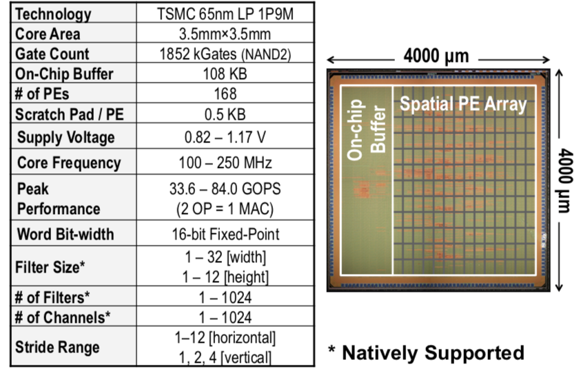
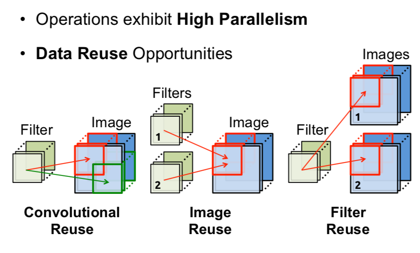
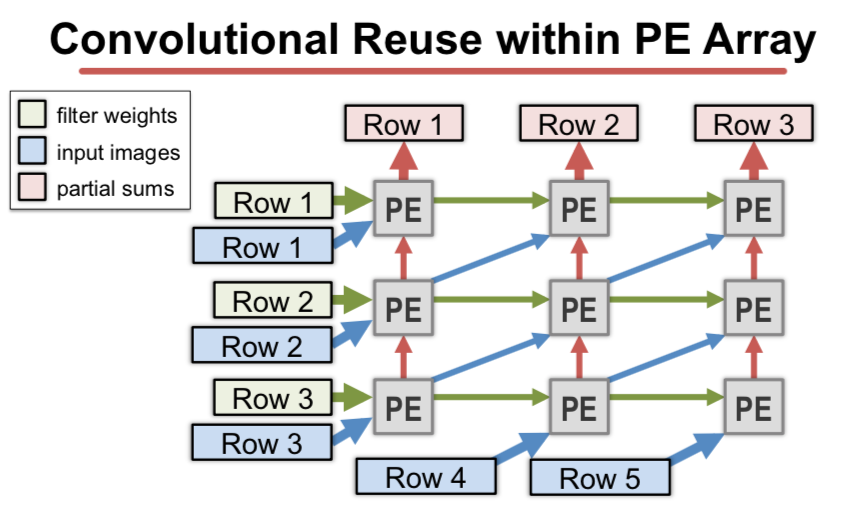
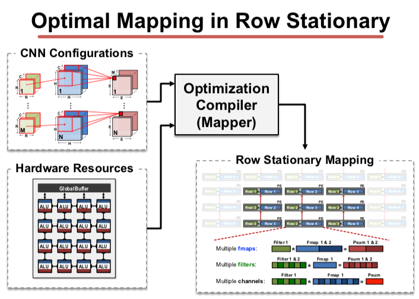
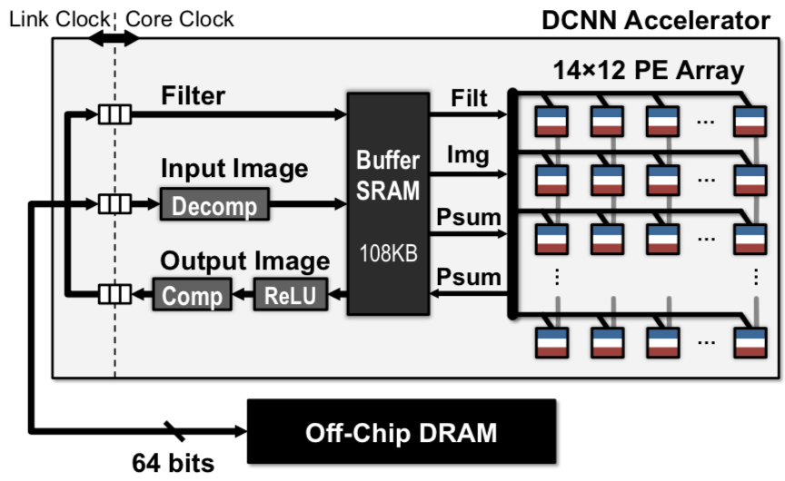

# Eyeriss Chip simulator
fully powered by Jialinli

## What's Eyeriss chip ?
* [Eyeriss](http://www.mit.edu/~sze/eyeriss.html) is an AI accelerator, researched by Massachusetts Institute of Technology
* EyerissF is a python-made Eyeriss simulator, aiming to test eyeriss capability. 


## Vital reference from MIT !
1. Eyeriss: An Energy-Efficient Reconfigurable Accelerator for Deep Convolutional Neural Networks [ISSIC 2016] [here](http://www.rle.mit.edu/eems/wp-content/uploads/2016/02/eyeriss_isscc_2016.pdf)
1. Eyeriss: An Energy-Efficient Reconfigurable Accelerator for Deep Convolutional Neural Networks slides [ISSIC 2016] [here](http://www.rle.mit.edu/eems/wp-content/uploads/2016/02/eyeriss_isscc_2016_slides.pdf)
1. **Hardware Architectures for Deep Neural Networks** [ISCA 2017] [here](http://www.rle.mit.edu/eems/wp-content/uploads/2017/03/Tutorial-on-DNN-CICS-MTL.pdf)

1. Eyeriss: A Spatial Architecture for Energy-Efficient Dataflow
for Convolutional Neural Networks [ISCA 2016] [here](http://www.rle.mit.edu/eems/wp-content/uploads/2016/04/eyeriss_isca_2016.pdf)

1. DNN Accelerator
Architectures slides [ISCA 2017] [here](http://www.rle.mit.edu/eems/wp-content/uploads/2017/06/Tutorial-on-DNN-4-of-9-DNN-Accelerator-Architectures.pdf)

## Eyeriss brief introduction

Eyeriss is an accelerator that can deliver state-of-the- art accuracy with minimum energy consumption in the system (including DRAM) in real-time, by using two key methods:
1. efficient dataflow and supporting hardware (spatial array, memory hierarchy and on-chip network) that minimize data movement by exploiting data reuse and support different shapes; 
1. exploit data statistics to minimize energy through zeros skipping/gating to avoid unnecessary reads and computations; and data compression to reduce off-chip memory bandwidth, which is the most expensive data movement.

## How can we modify CNN calculation?


From CNN defined calculation to new CNN Calculation, via new ASIC chip, we found a few processes could be combine together or run parallelly.
* **high parallelism**

This pic shows the dataflow within the array for filter weights, image values and partial sums. If the filter height (R) equals the number of rows in the array , the logical dataflow would be as follows:
1. filter weights are fed from the buffer into the left column of the array (one filter row per PE) and the filter weights move from left to right within the array.
1. image values are fed into the left column and bottom row of the array (one image row per PE) and the image values move up diagonally.
1. partial sums for each output row move up vertically, and can be read out of the top row at the end of the computational pass. If the partial sums are used in the next pass, they are fed into the bottom row of the array from the buffer at the beginning of the next computational pass.


* **data reuse**
    * Convolutional reuse
    * Image reuse
    * Filter reuse

While existing dataflows attempt to maximize certain types of input data reuse or minimize the psum accumulation cost, they fail to take all of them into account at once. This results in inefficiency when the layer shape or hardware resources vary. Therefore, it would be desirable if the dataflow could adapt to different conditions and optimize for all types of data movement energy costs. In this section, we will introduce a novel dataflow, called row stationary (RS) that achieves this goal. The RS dataflow is a key feature of the Eyeriss architecture, which has been implemented in a fabricated chip.


## Eyeriss structure 


## How can I leverage THIS REPOSITY?

### File structure
* EyerissF
    * [PE.py](PE.py) ( inner single calculate processor)
    * [EyerissF.py](EyerissF.py) (contain 168 PEs cluster charge conv2d funx)
    * [conf.py](conf.py) ( default Eyeriss config features)
    * [IO2.py](IO2.py) ( Compress and Decompress funx)
* Hive
    * [Activiation.py](Activiation.py)
    * [Pooling.py](Pooling.py)
    * [Hive.py](Hive.py)
* CNN 
    * [Lenet5_Hive.py](Lenet5_Hive.py )( a Hive made Lenet CNN)
    * [Lenet5_Hive_Auto.ipynb](Lenet5_Hive_Auto.ipynb)
    * [Lenet5_Hive_Manuel.ipynb](Lenet5_Hive_Manuel.ipynb)
    * [Lenet5_Hive_Manuel_withPics.ipynb](Lenet5_Hive_Manuel_withPics.ipynb)
* other
    * [Extension.py]( Extension.py) ( change numpy arrary into pics)
    * [filterReset.py]( filterReset.py) ( Reset lenet5 factors)
    * [Test.py]( Test.py) ( debug file)

### Hive platform

Hive is a new CNN platform based on Eyeriss chip or EyerissF simulator, which contains basic funxs to establish CNN.
Eyeriss or EyerissF just only an ASIC chip and python-made simulator and can not achieve any tasks. In order to do pattern regonization tasks, it must have a mature platform to support standard input data.
Hive is aiming to tranfor 3-channel jpg pics to input Eyeriss supported stream and decompress results.


If u wanna use hive to create CNN, u should do following steps:

1. init EyerissF simulator 
```python
ef = EyerissF()
```
or

```python
ef = EyerissF("manual")
```

1. init Hive
```python
hive = Hive(ef)
```

Other funxs from Hive
1. convolution ( Eyeriss Supported)
```python
hive.conv2d(pics,filters,number of pics, number of filters)
```
1. Pooling
```python
hive.Pooling(pics)
```
1. FullConnect
```python
hive.FullConnect(vector,vector2)
```


## contact me
please Email jialinli@linkedin.com

## last updated
2019 May 10th

## __future__
1. changing name in case of any misunderstanding with 'Apache Hive'
1. overriding file constructions to make basic code in src folder
1. add new functions in energy stream calculation between different storage layers 